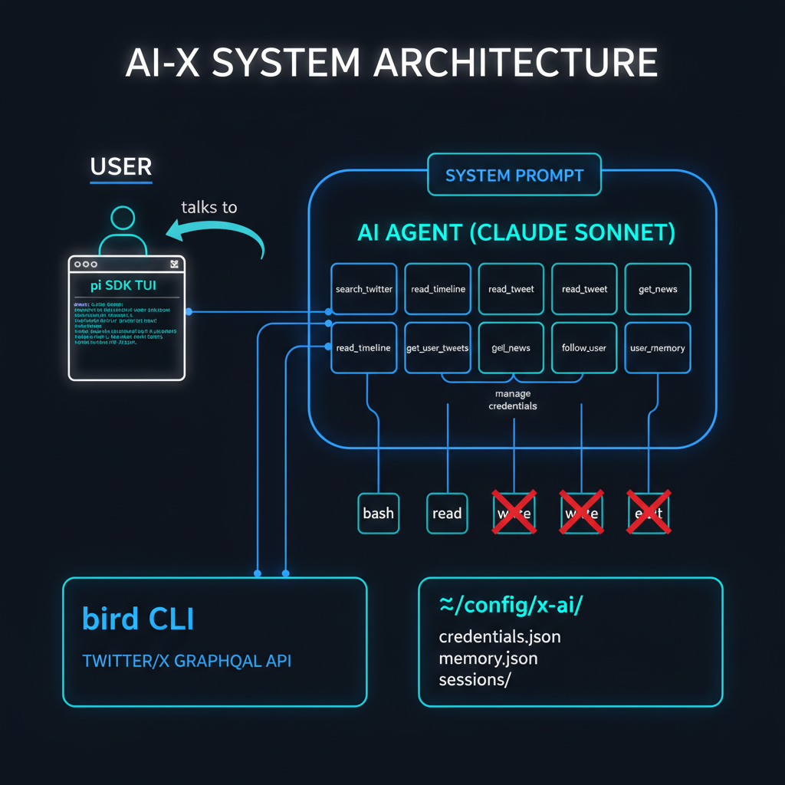

# ai-x

A conversational AI agent that helps engineers stay up-to-date with AI news on Twitter/X — without doomscrolling.

Built on [pi.dev](https://pi.dev/) SDK with a locked-down tool surface: the agent can only read Twitter and manage your preferences. No filesystem access, no arbitrary commands.

## Prerequisites

- **Node.js** >= 20 (22+ recommended for full `bird` compatibility)
- **bird CLI** — Twitter/X client used under the hood
- **Anthropic API key** — for the LLM (Claude Sonnet 4.5 by default)

### Install bird

```bash
# npm
npm install -g @steipete/bird

# Homebrew (macOS)
brew install steipete/tap/bird
```

### Set your API key

```bash
export ANTHROPIC_API_KEY=sk-ant-...
```

## Install

```bash
git clone https://github.com/DaniFdz/ai-x.git
cd ai-x
npm install
```

## Usage

```bash
npm start
```

This opens an interactive terminal UI powered by pi. On first launch, the agent will ask you to set up Twitter/X credentials — either via browser cookies (easiest) or manual tokens.

### Example conversations

```
> What happened in AI twitter today?
> What has @karpathy been posting lately?
> Search for what people are saying about Claude Code
> Tell me more about that thread
> Follow researchers who talk about AI agents
```

The agent learns your interests over time. It remembers which topics you care about, your preferred accounts, and how detailed you like your summaries.

## Architecture



The agent runs inside a pi SDK session with **only 8 custom tools** — no `bash`, `read`, `write`, or `edit`:

| Tool | What it does |
|------|-------------|
| `manage_credentials` | Check/save Twitter auth (stored in `~/.config/x-ai/credentials.json`) |
| `search_twitter` | Search tweets by query |
| `read_timeline` | Read your home timeline (Following or For You) |
| `read_tweet` | Read a specific tweet, thread, or its replies |
| `get_user_tweets` | Get recent tweets from a specific user |
| `get_news` | Get trending/AI-curated news from Explore |
| `follow_user` | Follow a user (**only when you explicitly ask**) |
| `user_memory` | Persist your interests and preferences across sessions |

### Data storage

All config lives in `~/.config/x-ai/`:

```
~/.config/x-ai/
├── credentials.json   # Twitter/X auth tokens
├── memory.json        # Your interests, preferred accounts, summary style
└── sessions/          # Conversation history (managed by pi)
```

## Development

```bash
npm run dev    # Watch mode with tsx
npm run build  # Compile TypeScript to dist/
```

## License

MIT
